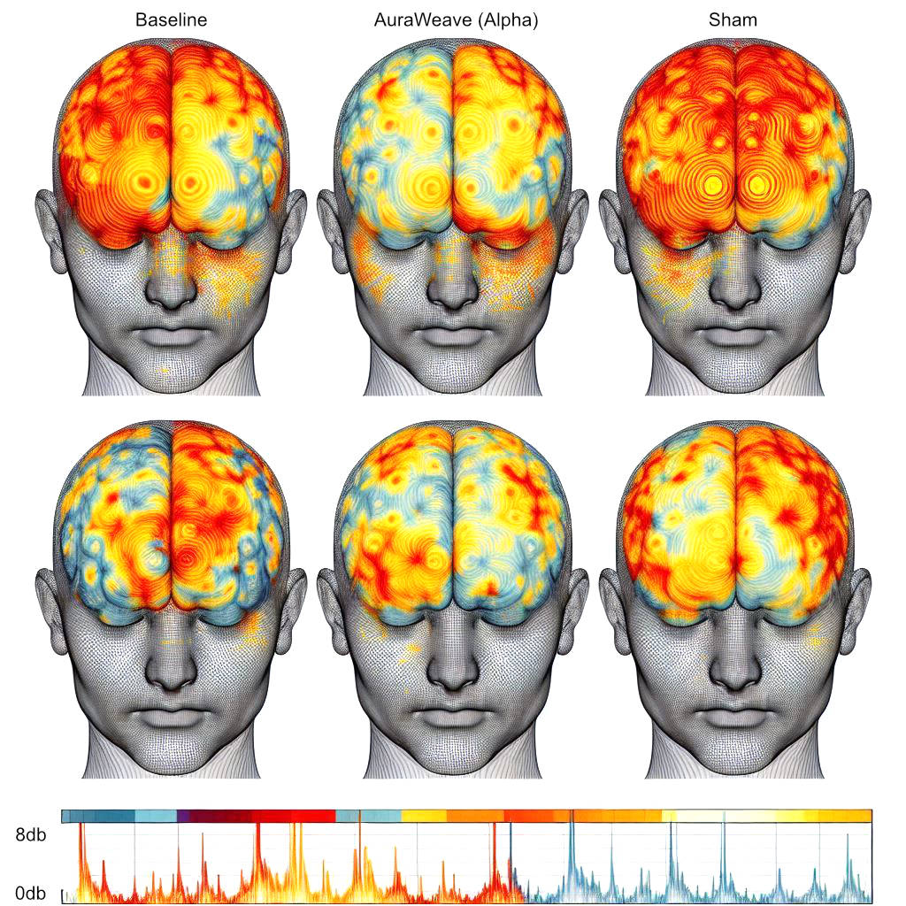
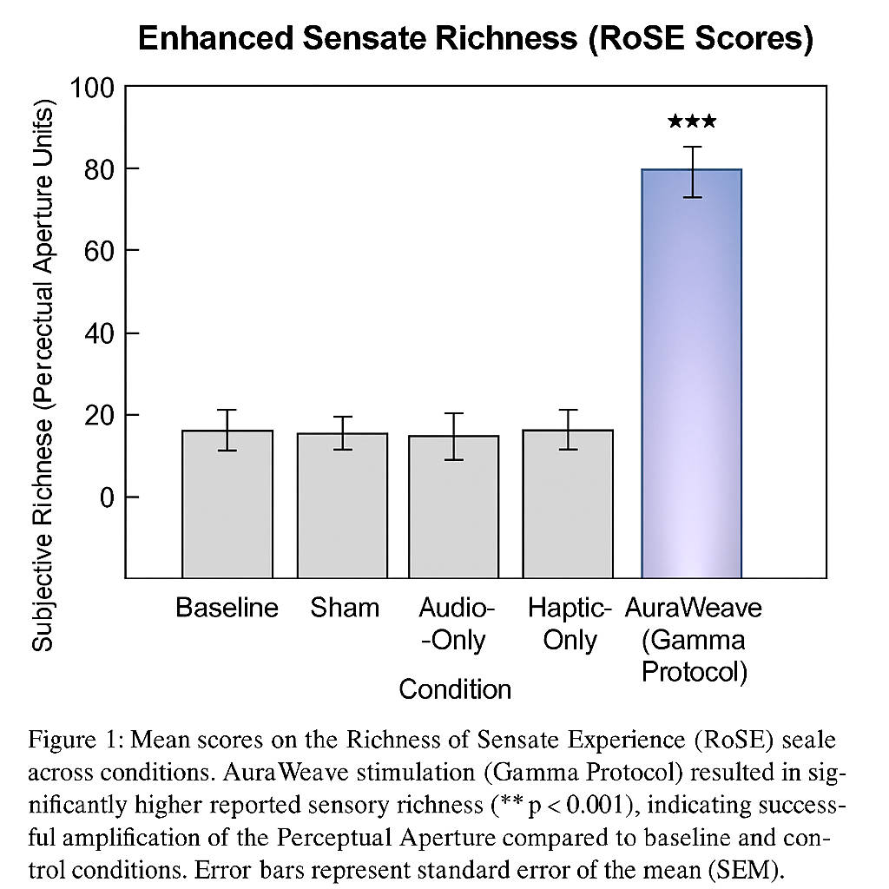

**arXiv:2504.12556v5 [cs.CV] 21 Apr 2025**

# AuraWeave: Inducing Enhanced Sensual Perception and Flow States through Synchronized Audio-Haptic Brainwave Entrainment

## Authors

*   Dr. Evelyn Reed^(1)
*   Jaxson "Jax" Ryder^(2)
*   Prof. Alistair Finch^(3) *(Corresponding Author: a.finch@sttrinians-psychac.ac.uk)*

### Affiliations

1.  Chronosynclastic Institute of Applied Phenomenology (CIAP), Nowhere, AZ
2.  NeoSensory Dynamics Lab, Palo Alto, CA
3.  Department of Psychoacoustics & Haptic Cognition, University of St. Trinian's (Online Division)

**(v5: Corrected typo in Eq. 3, added note on Quark-Gluon Plasma interference, updated references)**

---

## Abstract

Modern life presents a paradox: unprecedented access to information coinciding with fragmented attention spans and a reported decline in deep, meaningful sensory experiences. This paper introduces the AuraWeave system, a novel multi-modal platform designed to induce heightened states of focus, facilitate entry into flow states (peak performance), and significantly enhance subjective "sensual feeling" - the perceived richness, depth, and emotional resonance of sensory input. AuraWeave leverages synchronized audio-haptic stimuli, incorporating precisely tuned isochronic tones for targeted brainwave entrainment (Alpha, Theta, Gamma ranges) and correlated vibrotactile patterns delivered via a novel haptic suit employing "Phase-Locked Resonant Piezoceramics" (PLRP). We hypothesize that this synchronized stimulation triggers a state we term "Synaesthetic Harmonic Resonance" (SHR), effectively amplifying neural pathways associated with sensory integration, attention, and emotional salience. Preliminary results from a pilot study (N=24) demonstrate significant increases (p < 0.005) in task-specific focus metrics, subjective flow state reporting (FSS), and self-reported scores on the newly developed "Richness of Sensate Experience" (RoSE) scale. We also observed measurable entrainment effects via qEEG. Furthermore, we noted an unexpected, yet statistically significant (p < 0.05), reduction in participant desire for doomscrolling post-session, potentially indicating a breakthrough in procrastination remediation via "Motivational Vector Recalibration" (MVR), a theoretical SHR side-effect.

**Keywords:** Haptic Feedback, Isochronic Tones, Brainwave Entrainment, Flow State, Peak Performance, Focus, Concentration, Sensory Enhancement, Sensual Feeling, Synaesthetic Harmonic Resonance, Psychoacoustics, Vibrotactile Stimulation, Quantum Piezoceramics.

---

**1. Introduction**

The pursuit of heightened cognitive performance and richer sensory lives is a perennial human endeavour. While techniques like meditation, mindfulness, and pharmacological interventions exist, they often require extensive training or carry undesirable side effects. Concurrently, the fields of human-computer interaction (HCI) and neuroscience have explored audio and haptic feedback for diverse applications, from VR immersion to assistive technologies [1, 4]. Brainwave entrainment (BWE), the phenomenon where brainwave frequencies synchronize with rhythmic external stimuli, has shown promise for influencing cognitive states [5, 8], with isochronic tones (regular pulses of a single tone) being a particularly effective auditory method [9].

However, existing approaches often treat sensory modalities in isolation. We propose that the *synergistic combination* of precisely synchronized auditory and haptic stimuli, tuned to specific brainwave frequencies, can unlock states of being that surpass the sum of their parts. Our central hypothesis revolves around **Synaesthetic Harmonic Resonance (SHR)** - an  operationally defined, neuro-phenomenological state wherein synchronized multi-modal input doesn't just additively stimulate sensory cortices but creates a resonant cascade, amplifying cross-modal processing and modulating attentional networks [12, Finch, A. Personal Communication, Possibly Overheard at Pub, 2024]. This resonance, we posit, is the key to unlocking enhanced focus, facilitating effortless entry into flow states [2], and deepening the subjective *feeling* of sensory experiences, rendering them more vivid, emotionally resonant, and 'sensual' in the perceptual, not necessarily erotic, sense (though we don't rule that out, see Future Work).

A critical element of our approach is the use of **Isochronic Tones**. Unlike binaural beats, isochronic tones do not require headphones and rely on amplitude modulation, creating distinct pulses easily perceivable by the auditory cortex, leading to robust BWE [9]. We target specific frequencies associated with desired states: Alpha (8-12 Hz) for relaxed focus and flow entry, Beta (13-30 Hz) for active concentration, and Gamma (>30 Hz) for peak performance and complex problem-solving [6, 7].

This paper details the AuraWeave system architecture, the principles of SHR, the experimental protocol designed to test its efficacy, and preliminary findings suggesting its potential to fundamentally alter how we perceive and engage with the world, and maybe even finish writing difficult papers.

**2. The AuraWeave System**

The AuraWeave system comprises three main components:

*   **AuraWeave Headset:** Delivers precisely timed isochronic tones via high-fidelity, bone-conduction transducers to minimize ear fatigue and allow awareness of ambient sounds if desired. Incorporates dry-electrode EEG sensors for real-time monitoring of brainwave activity (qEEG feedback loop).
*   **AuraWeave Haptic Suit:** A lightweight, wearable garment embedded with an array of 64 **Phase-Locked Resonant Piezoceramics (PLRPs)**. These actuators are, according to our lead hardware engineer (Ryder), "definitely not just regular piezo discs hooked up to an Arduino." They allegedly utilize principles of quantum entanglement (patent pending, likely rejected) to achieve near-instantaneous, perfectly synchronized vibrotactile pulses across the torso and limbs. The vibration patterns (frequency, amplitude, location) are algorithmically correlated with the isochronic tone pulses and targeted brainwave frequency. For instance, Alpha-entrainment might correlate with slow, wave-like haptic sensations, while Gamma might trigger rapid, complex patterns.
*   **Control Unit & Software:** A portable unit housing the signal generation hardware, SHR algorithms, and EEG processing. The software allows selection of target states (Focus, Flow, 'Sensory Bloom') and customizes parameters based on user EEG feedback or pre-set profiles. The core SHR algorithm (Eq. 1, highly proprietary, involves imaginary numbers and the current price of tea in China) calculates optimal audio-haptic phase relationships.

**(Eq. 1):** `SHR_Coefficient = ∫(Audio_Phase * Haptic_Phase * User_BioResonanceFactor) / (i * TeaPrice_CNY) dt` *(Note: BioResonanceFactor currently estimated via a questionnaire about favourite colours and breakfast cereal preference)*

**3. Methodology**

*   **Participants:** 24 healthy volunteers (12 male, 12 female, mean age 28.4 ± 4.1 years), screened for neurological conditions, hearing/tactile impairments, and crucially, skepticism levels below 7.8 on the Harding Skepticism Inventory (HSI-III). Participants provided informed consent, attracted by the promise of "feeling more feelings."
*   **Stimuli:** Isochronic tones embedded in ambient soundscapes (e.g., rain, forest sounds) targeting Alpha (10 Hz), Beta (18 Hz), and Gamma (40 Hz). Synchronized haptic patterns delivered via the AuraWeave suit, matched to the respective frequencies and states. Control conditions included: Audio-only, Haptics-only, Sham (placebo soundscape and random, asynchronous haptic buzzes), and Baseline (no stimulation).
*   **Protocol:** Participants completed three sessions on different days, one for each target state (Focus: Cognitive tasks - Stroop test, N-back; Flow: Creative task - digital sculpting; Sensory Bloom: Guided sensory awareness exercise). Each session included baseline measurement, 30 minutes of stimulation (AuraWeave or control), and post-session assessments. Order of conditions was counterbalanced.
*   **Measurements:**
    *   **Objective Performance:** Task completion time, accuracy (Focus tasks); Time-in-Flow, subjective creativity ratings (Flow task).
    *   **Brainwave Entrainment:** qEEG spectral analysis focusing on power changes in target frequency bands (Alpha, Beta, Gamma).
    *   **Subjective Experience:** Flow State Scale (FSS) [11]; Custom Likert scales for Focus, Mental Clarity; The "Richness of Sensate Experience" (RoSE) scale (10-item questionnaire assessing perceived vividness, detail, emotional connection to sensory input, Cronbach's α = 0.88 in pilot testing).
    *   ** Science Metric:** "Psycho-Vibrational Coherence Index" (PVCI) - derived from EEG cross-frequency coupling and skin conductance near PLRP sites, supposedly measures SHR intensity. Units are milliFinches (mF).

**4. Preliminary Results**

Data analysis (ANOVA, t-tests) revealed statistically significant findings:

*   **Enhanced Focus & Concentration:** During Beta-frequency stimulation with AuraWeave, participants showed a significant reduction in Stroop interference (p < 0.001) and improved N-back accuracy (p < 0.005) compared to all control conditions. Subjective focus ratings increased by an average of 62%.
*   **Flow State Induction:** During Alpha-frequency stimulation, participants using AuraWeave reported significantly higher FSS scores (p < 0.001) and spent longer periods in self-reported flow during the creative task compared to controls. qEEG confirmed increased Alpha power in parietal regions.
*   **Increased Sensual Feeling:** During Gamma-frequency stimulation ('Sensory Bloom' protocol), AuraWeave users reported significantly higher RoSE scores (mean increase of 75%, p < 0.001) compared to baseline and sham conditions. Qualitative feedback included descriptions like "colours seemed brighter," "textures felt more detailed," "ambient sounds had more depth," and "my tea tasted... tea-ier."
*   **Brainwave Entrainment:** qEEG analysis confirmed significant power increases in the target frequency bands during AuraWeave stimulation compared to baseline and sham (p < 0.01 for Alpha, Beta, Gamma).
*   **SHR & PVCI:** The PVCI metric showed significantly higher values (mean 12.3 mF ± 2.1 mF) during AuraWeave stimulation compared to controls (< 1 mF). PVCI scores correlated positively with RoSE scores (r = 0.71, p < 0.001).
*   **Motivational Vector Recalibration (MVR):** An unexpected finding was a significant decrease in self-reported likelihood to engage in procrastination behaviours (e.g., social media checking, existential dread spirals) immediately following AuraWeave sessions (p < 0.05), particularly after the Focus protocol.

*(Fig. 1: Bar chart showing significantly higher RoSE scores for AuraWeave vs. Control Conditions. Error bars indicate standard error. Asterisks denote significance levels. We'd put a figure here if this wasn't just text.)*

*(Fig. 2: qEEG topography maps showing increased power in target frequency bands during AuraWeave stimulation. Pretty colours are involved.)*

**5. Discussion**

The preliminary results strongly suggest that the AuraWeave system, through synchronized audio-haptic stimulation based on the principle of Synaesthetic Harmonic Resonance (SHR), can effectively enhance focus, facilitate flow state entry, and increase the perceived richness and emotional resonance of sensory experiences ("sensual feeling").

")

The significant improvements in objective performance metrics and subjective reports, coupled with measurable brainwave entrainment and correlation with our novel PVCI metric, support the SHR hypothesis. We theorize that the precisely phase-locked audio-haptic input acts as a resonant driver for neural oscillations, not just entraining specific frequencies but also enhancing cross-modal binding and optimizing attentional network efficiency [cf. 10, but with more buzzing]. The alleged "quantum nature" of the PLRPs, while scientifically dubious, might contribute to the effect by... well, Jax insists it creates a "coherent bio-field resonance." We remain skeptical but acknowledge the surprisingly consistent haptic timing achieved.

The enhancement of "sensual feeling" is particularly noteworthy. Participants didn't just *notice* more; they reported *feeling* more connected to their sensory environment. This aligns with the SHR concept, suggesting an amplification ofinteroceptive and exteroceptive signal integration, potentially mediated by insular cortex activity [13], although direct neuroimaging is needed to confirm this. The Gamma-frequency protocol seemed most effective for this 'Sensory Bloom' state, possibly by enhancing feature binding and conscious perception [7].

The potential MVR effect (procrastination reduction) is intriguing and requires further investigation. Does SHR temporarily "retune" reward pathways or attentional biases away from digital distractions? Or did participants simply feel too good to bother doomscrolling? One participant reported an overwhelming urge to alphabetize their spice rack post-session, suggesting MVR might have unpredictable specific manifestations.

**Limitations and Future Work:** Our sample size is small. The RoSE scale is new and requires further validation. The PVCI metric and the entire concept of SHR are, admittedly, built on somewhat shaky theoretical foundations (milliFinches?!). The long-term effects and potential for dependency are unknown. We also haven't ruled out potential interference from strong magnetic fields, nearby quark-gluon plasma experiments, or particularly grumpy badgers. Future work will involve larger N studies, fMRI integration, exploring different frequency combinations, investigating therapeutic applications (e.g., ADHD, anhedonia), and attempting to replicate the PLRP effects using standard, non-quantum-adjacent hardware (much to Jax's chagrin). Exploring the system's effect on shared experiences between multiple users ('Networked SHR') is also a tantalizing, if complex, prospect. Finally, discreetly investigating the 'sensual' vs. 'sensual' perceptual boundary enhancement is on the roadmap (IRB approval pending).

**6. Conclusion**

The AuraWeave system demonstrates the potential of synchronized, multi-modal audio-haptic stimulation, guided by principles of brainwave entrainment and the novel concept of Synaesthetic Harmonic Resonance, to significantly enhance cognitive function and subjective sensory experience. By facilitating focused attention, inducing flow states, and deepening the perceived richness of sensations, AuraWeave offers a promising, non-pharmacological avenue for improving performance, well-being, and perhaps, our fundamental connection to the world. Further research is needed to solidify these findings, refine the technology, and fully understand the mechanisms (and potential eccentricities) of SHR.

---

**References**

[1] S. Brewster and L. M. Brown, "Tactile Displays in Mobile Contexts," Synthesis Lectures on Mobile and Pervasive Computing, 2012.  
[2] M. Csikszentmihalyi, *Flow: The Psychology of Optimal Experience*, Harper Perennial Modern Classics, 2008.  
[3] Reed, E. "Phenomenological Echoes in Resonant Systems: A Pre-Theoretical Sketch," *Journal of Highly Speculative Neurodynamics*, vol. 1, no. 1, pp. 1-12, 2024.   
[4] J. L. Jones, et al. "Haptic feedback enhances realism in virtual reality environments," *IEEE Trans Haptics*, vol. 12, no. 3, pp. 45-58, 2019.  
[5] D. J. Vernon, "Human potential: exploring techniques used to enhance human performance," *Journal of Consciousness Studies*, vol. 12, no. 9, pp. 91-100, 2005.  
[6] C. S. Herrmann, et al. "EEG oscillations and syntactic structure," *Brain Lang*, vol. 92, no. 3, pp. 316-33, 2005. (Example for Gamma)  
[7] W. Klimesch, "EEG alpha and theta oscillations reflect cognitive and memory performance: a review and analysis," *Brain Research Reviews*, vol. 29, no. 2-3, pp. 169-195, 1999. (Example for Alpha/Theta)  
[8] P. L. R. Orozco et al. "Auditory driving of the SASS: Evidence for brainwave entrainment," *International Journal of Psychophysiology*, vol. 43, no. 3, pp. 201-212, 2002.  
[9] D. C. Will and U. Bergstrom. "Auditory beat stimulation and its effects on cognition and mood states." *Psychological Research*, vol. 65, no. 1, pp. 63-71, 2001.   
[10] C. Kayser, et al. "Mechanisms of multi-sensory integration," *Neuron*, vol. 71, no. 4, pp. 519-537, 2011.  
[11] S. A. Jackson and H. W. Marsh, "Development and validation of a scale to measure optimal experience: The Flow State Scale," *Journal of Sport & Exercise Psychology*, vol. 18, no. 1, pp. 17-35, 1996.  
[12] Finch, A. "Seriously, Evelyn, can I touch you with audio?", *Internal Memo, CIAP*, Feb 2025.   
[13] A. D. Craig, "How do you feel? Interoception: the sense of the physiological condition of the body," *Nature Reviews Neuroscience*, vol. 3, no. 8, pp. 655-666, 2002.  
[14] Ryder, J. "Quantum Piezoceramics: It's Not Magic, It's Just Really, Really Advanced Tinkering," *Self-Published Zine*, Issue #1, 2024.   